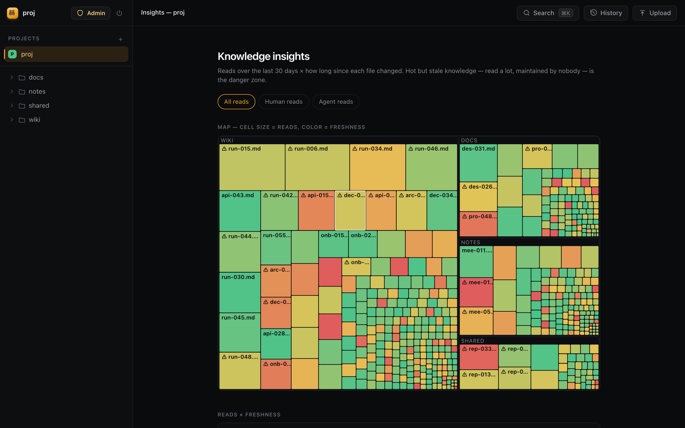
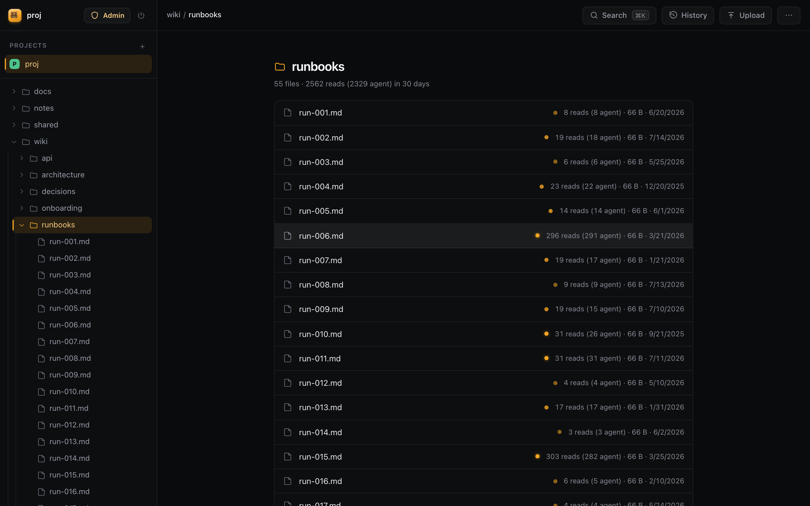
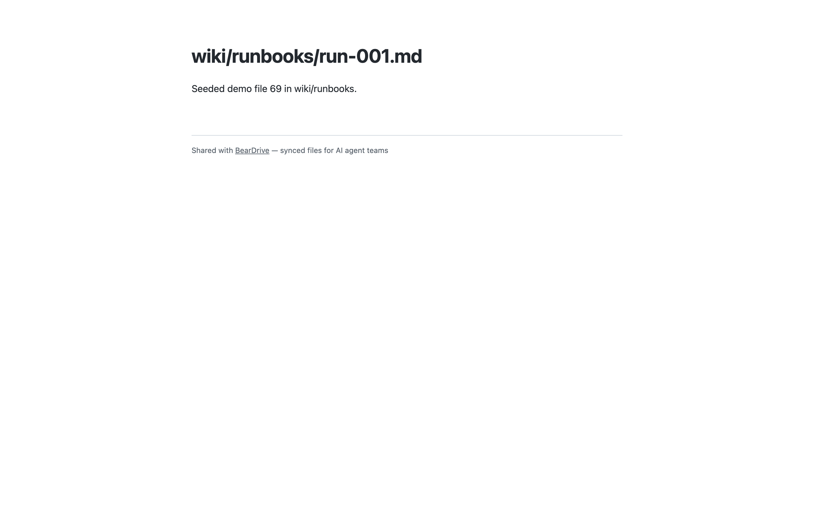

# BearDrive — Google Drive for AI agents

**BearDrive** mounts any folder as a synced volume: its contents stay
synchronized across all your devices and teammates through a BearDrive
**hub**, every change is tracked (who, when, on which device), and
everything keeps working offline. The CLI is `bdrive`; a hub is a
`bdrive web` server you (or we) run on an object store — clients sync
through it over HTTPS and never touch the storage directly.

What it's for, first and foremost: **sharing context across AI agents** —
give every agent on the team the same folder as memory, and your agent
knows what their agent knows. (People are covered too: any synced file
becomes a public URL that renders as a page.) Notes, plans, findings, and
artifacts follow the team everywhere — and unlike a memory API, they stay
**real files with provenance**: every change is attributed to the human,
agent, and device that made it, and the hub's Insights show what your
agents actually read (and which hot-but-stale docs nobody maintains).

<p align="center">
  
</p>

| Browse with read heat | Public share pages |
|---|---|
|  |  |

```console
$ bdrive login https://your-hub   # once per device — self-host a hub in ~10 min (docs/self-hosting.md)
$ cd ~/workspace && bdrive init
initialized /Users/snow/workspace
  project: workspace (p-7f3a2c91)
  daemon:  running (pid 55434, scan 3s, remote sync 10s)
```

> BearDrive Cloud — zero-setup, bare `bdrive login`, free personal
> workspace on signup — at [beardrive.ai](https://beardrive.ai). Or
> self-host your own hub.

On another machine:

```console
$ bdrive login https://your-hub && cd ~/workspace && bdrive init
# … connect the same project; the files appear and stay in sync
```

## Features

- **Any folder is a project** — `bdrive init` turns any folder into a synced
  project. Files are *real files on disk*: every tool, editor, and agent can
  use them with zero integration work. Rename or move the folder freely —
  state is keyed by a stable id, never the path.
- **Multi-device sync** — devices converge through a shared hub. Each
  device only writes its own append-only journal, so no locking service is
  needed; the hub can be backed by any object store.
- **Change tracking** — `bdrive log` and the web UI's History view show
  which account changed which file, when, from which device (name, OS, IP).
  Content is stored content-addressed, so every version is retained — view
  or download any point in a file's history.
- **Cloud-provider agnostic** — a hub can store on Amazon S3 (`s3://`),
  Google Cloud Storage (`gs://`), any S3-compatible store (MinIO, Cloudflare
  R2 via `AWS_ENDPOINT_URL`), or a plain shared directory (`file://`, e.g. a
  NAS). Clients never see it.
- **Offline-first** — the working folder is always fully usable with no
  network. Changes are journaled locally and pushed when the remote becomes
  reachable again.
- **Conflict-safe** — concurrent edits resolve deterministically
  (last-writer-wins), and the losing version is preserved as a
  `name.bdrive-conflict-<device>-<time>` file. Nothing is silently dropped.
- **Selective sync** — a gitignore-style `.bdriveignore` opts files out, and
  `bdrive init --shared <dir>` (or the interactive prompt) narrows sync to
  one shared subfolder.
- **macOS & Linux.**

## Install

```sh
brew install runbear-io/tap/beardrive  # macOS (and Linuxbrew); installs the `bdrive` CLI
```

or from source:

```sh
go install github.com/runbear-io/beardrive/cmd/bdrive@latest
```

## Quick start

```sh
# 1. Sign this device in against your hub (once per device).
#    Self-host a hub in ~10 minutes (docs/self-hosting.md), then:
bdrive login
#    (BearDrive Cloud: sign up in the browser, get a free personal
#    workspace automatically. Self-hosting? bdrive login https://your-hub)

# 2. Start syncing a project — interactive: create or connect a project,
#    sync the whole folder or just ./shared. Re-run any time to resume.
cd ~/my-project && bdrive init

# 3. Work normally — create, edit, delete files with any tool.
echo "remember this" > memory.md

# On every other device: `bdrive login https://your-hub` once, then bdrive init in a folder
# and connect the same project.

# See what changed, who changed it, and from which device
bdrive log

# Check sync state and the daemon
bdrive status

# Stop syncing (files stay on disk; bdrive init resumes any time)
bdrive stop
```

Renaming or moving a project folder is safe: state is keyed by a stable
project id, never the path. The daemon notices the move, steps aside, and
the next `bdrive init` (or any bdrive command) at the new location resumes
exactly where it left off — zero re-scan, zero spurious changes.

### Credentials

beardrive uses each provider's standard credential chain — nothing beardrive-specific.
Note: **client devices always use an `https://` hub remote** — the
`s3`/`gs`/`file` rows below are how the *hub operator* configures the
hub's own storage, never something a syncing client points at directly:

| Remote | Credentials |
|---|---|
| `s3://bucket/prefix` | `AWS_PROFILE`, `~/.aws/credentials`, env vars, IAM roles. S3-compatible stores via `AWS_ENDPOINT_URL`. |
| `gs://bucket/prefix` | Application Default Credentials (`gcloud auth application-default login`) or `GOOGLE_APPLICATION_CREDENTIALS`. |
| `file:///path` | none — any local or network-mounted directory |
| `https://host:port/p/<id>` | none — syncs through a bdrive web hub; only the server holds storage credentials (see [The sync hub and `bdrive init`](#the-sync-hub-and-bdrive-init)) |

## Commands

| Command | Description |
|---|---|
| `bdrive login [server-url]` | Sign this device in (browser flow; `--device` for headless; default server beardrive.ai — the managed cloud, free personal workspace on signup; pass your hub URL to self-host). Switch hubs with `bdrive login <new-url>` |
| `bdrive logout` | Sign this device out — clear the saved token/account (`--forget` also drops the remembered server) |
| `bdrive init [folder]` | Create/connect a project and start syncing — interactive on a TTY, flags (`--name/--project/--shared/--yes`) for scripts; re-run to resume |
| `bdrive stop [folder]` | Stop syncing (files stay; `bdrive init` resumes) |
| `bdrive url [path]` | Internal hub link for a file/folder (sign-in + membership required; `--sync` pushes first; no arg = project home). Computed locally |
| `bdrive share <file>` | Public URL for a synced file (`--list`, `--revoke`, `--expires`) |
| `bdrive sync [folder]` | Run one sync cycle now. `--note <text>` stamps session context (e.g. an agent session id) onto changes — shown in `bdrive log` and hub history; keeps applying to daemon-committed changes until `--note-ttl` (default 30m) expires. `--hook <label>` is agent-hook plumbing: event JSON on stdin, sync + note, gated-link formula (Claude Code hook JSON) on stdout |
| `bdrive hooks [install]` | Register turn-boundary sync hooks with detected agent platforms (Claude Code, Codex, Gemini CLI, Hermes) — pull each turn, push after edits, session-note stamping, agent-read tracking; idempotent (`--agent` overrides detection) |
| `bdrive skill [install]` | Install the `beardrive` skill into detected agent platforms (`~/.codex/skills/beardrive/SKILL.md` and friends) so the agent can do the setup itself — sign in, `bdrive init`, and register the sync hooks; idempotent (`--agent` overrides detection) |
| `bdrive read-log [folder]` | Hook plumbing: queue agent file reads from a hook event (JSON on stdin) for the hub's read heatmap — native reads, grep matches, and files named in shell commands; drained on the next sync. Registered by `bdrive hooks install` |
| `bdrive status [folder]` | Projects, daemon state, pending changes |
| `bdrive log [folder] [-p path] [-n N]` | Change history: account, device, time, file |
| `bdrive web [folder \| storage-root-url]` | Web server: viewer (rendered markdown, downloads, history), uploads, multi-project sync hub |
| `bdrive whoami` | Device identity used in change tracking |

## Project files

Each mounted folder carries its own settings, so configuration travels with
the project:

- **`.bdrive/`** — the folder's settings directory: `config.json` holds the
  **stable mount id** plus project/remote/include settings. Written by
  `bdrive init`, safe to hand-edit (a running daemon picks changes up
  automatically). Never synced, and it holds no credentials (the session
  token stays in `~/.bdrive`). Because everything is keyed by the mount id,
  the folder can be renamed or moved freely; copy it to another machine and
  `bdrive init` resumes the same project.
- **`.bdriveignore`** — gitignore-style opt-out list at the mount root. Syncs
  like a normal file, so every device shares the same rules. Supports `#`
  comments, `*`, `**`, `?`, trailing `/` for directories, leading `/` (or any
  `/`) for root-anchoring, and `!` to re-include.

```jsonc
// .bdrive/config.json
{ "id": "m-5a10b713", "volume": "notes",
  "remote": "https://drive.example.com/p/p-7f3a2c91", "include": ["shared/"] }
```

Opting out is non-destructive: when a pattern starts matching an
already-synced file, the file stops syncing but is deleted nowhere.

## Web server

`bdrive web` serves a website — browse folders and files, read markdown
rendered Obsidian-style (including `[[wikilinks]]`, task lists, and
tables), download any file — and, pointed at a storage root, becomes a
**multi-project sync hub**. It is read-only unless started with `--upload`.

```sh
bdrive web                              # serve the current directory (viewer)
bdrive web ./notes                      # serve a folder from disk (viewer)
bdrive web -c config.json               # everything from a config file
bdrive web s3://my-bucket/root --upload # multi-project sync hub
```

With a folder it serves files straight from disk — on a BearDrive mount the
daemon keeps them fresh, so this is the simplest read-only deployment (no
cloud credentials on the serving machine). With a storage root URL it runs
in hub mode, described below.

Flags: `--addr` (default `:4173`), `--volume` (display name), `--refresh`
(listing cache, default `10s`), `--dir` / `--remote` (explicit forms of
the positional argument), `--upload` (allow client writes, off by default),
`--upload-ttl` (presigned-URL lifetime, default `15m`), `--projects-db`
(hub project registry file, default `$BDRIVE_HOME/projects.json`),
`-c/--config` (read all of the above from a JSON file; explicit flags win):

```jsonc
// bdrive web -c config.json
{
  "remote": "s3://my-bucket/root",   // storage root (hub) — or "dir": "./folder" (viewer)
  "addr": ":4173",
  "upload": true,
  "upload_ttl": "15m",
  "refresh": "10s",
  "projects_db": "/var/lib/bdrive/projects.json",
  "share_rpm": 120,                  // per-IP rate limit on public /s/* links
  "auth": {                          // optional knobs; hub auth is always on
    // Signup is invite-only by default. To allow self-service signup,
    // open it WITH a gate (an ungated open hub is refused at startup):
    "allow_signup": true,
    "allowed_domains": ["example.com"],  // only these domains may sign up
    "require_approval": true,            // …and an admin must approve each one
    "users_db": "/var/lib/bdrive/auth.json",
    "admins": ["admin@example.com"],
    "smtp": { "host": "smtp.example.com", "port": 587,
              "user": "drive@example.com", "pass": "…", "from": "drive@example.com" }
  },
  "reads": {                         // read heatmap telemetry (hub mode)
    "enabled": true,                 // default true; aggregate counts only
    "retention_days": 400            // daily buckets older than this fold into all-time totals
  }
}
```

### The sync hub and `bdrive init`

In hub mode the server hosts many **projects** on one storage root — each
project's data lives under its own prefix (`<root>/<project-id>/`), and a
file-backed registry (`projects.json`, loaded at start, rewritten
atomically on every change) maps project ids to names. Client devices sync
whole folders through the hub without ever knowing where the storage is or
holding any cloud credentials; the server device is the only one configured
with the bucket.

Projects are walled by **organization**: every project belongs to one org
(file-backed `orgs.json`), and only that org's members — accounts with the
`owner` or `member` role — can see, browse, or sync it. Your first
`bdrive init` creates an org for you automatically; an owner invites
teammates from the web UI (the org name in the sidebar footer — Invite
mints an expiring join link, `/join/<token>`, that any signed-in account
can open to become a member). A hub upgraded from an earlier version
sweeps its existing projects into a `default` org that all existing
accounts join, so nothing breaks. Public share links stay outside the
wall on purpose.

```sh
# On the server device (knows the storage)
bdrive web -c config.json

# On each client device (knows only the server) — one command does it all:
bdrive login https://drive.example.com:4173   # once per device
cd ~/some-project && bdrive init              # once per project
```

`bdrive login` signs the device in and remembers the server (`settings.json`
under the bdrive home; bare `bdrive login` defaults to beardrive.ai — the
managed cloud, where signup auto-creates a free personal workspace; pass
your hub's URL to use a self-hosted hub instead — `--status` shows the
current server and account). To move to a **different
hub**, run `bdrive login <new-url>` and then re-run `bdrive init` in each
folder to connect it to a project there; `bdrive logout` signs out entirely.
`bdrive init` then, per
project, walks you through it on a terminal: **create a new project or
connect an existing one** (picked from the server's list), and **sync the
whole folder or only a shared subfolder** (e.g. `./shared`). Every question
has a flag (`--name`, `--project`, `--shared`, `--yes`), and without a TTY
init never prompts — it creates-or-joins a project named after the folder
and syncs everything. It writes `.bdrive/config.json`, seeds a starter
`.bdriveignore` (node_modules, build dirs, caches, `.env*`), and starts the
daemon — local changes are detected within seconds, and the Claude Code
plugin syncs at every session step. Not signed in yet? init runs the login
flow first.

Under the hood the `https://` remote speaks the hub's per-project
`/api/p/<id>/store` API — journal reads/writes relay through the server,
blob uploads go direct to the object store via the same short-lived
presigned URLs browser uploads use (falling back to relaying when the
backend can't presign). Client pushes and project creation require the
server to run with `--upload`; against a read-only hub, clients still pull
and their pushes wait (offline semantics) until allowed.

### Sharing files by URL

For teammates, every synced file already has an internal link — the hub
viewer URL, gated by sign-in and the project's org membership:

```console
$ bdrive url wiki/report.html
https://drive.example.com/p-1a2b3c4d/wiki/report.html
```

It's computed locally (no network), always shows the latest synced
content, and is the link agents should drop in their replies when they
create an artifact in the shared folder (`--sync` pushes first so a
just-created file resolves immediately).

For people **outside** the hub, any synced file can instead be shared
with a public link — hand someone the URL and they see the file, no
account needed:

```console
$ bdrive share wiki/report.html
https://drive.example.com/s/eacc1df3ee6a6ebbdacc535c2796dc30
```

Links always serve the file's **latest** synced content (right for wiki
pages and living reports), and live until revoked — `bdrive share --list`
and `--revoke <token-or-url>` manage them, `--expires 24h` makes one
self-destruct. The web UI has a Share button on every file.

Shared HTML renders as a real page, markdown renders like the viewer
(with a small "Shared with BearDrive" footer; raw HTML is served
byte-for-byte), PDFs open inline. Rendering is sandboxed: `/s/*` responses
carry a strict CSP, never see auth cookies, and sit behind a generous
per-IP rate limit (`share_rpm`), so a malicious shared file's scripts
can't touch hub sessions and a scraper can't turn the hub into a CDN.
Any org member can mint links, and a link is public to whoever has the
URL — don't share folders that hold secrets, and note a LAN-bound hub
means LAN-only links.

### Claude Code integration

The BearDrive plugin (`/plugin marketplace add runbear-io/beardrive`)
makes agents fluent in all of this, and **`/beardrive:install`** sets a
project up conversationally: installs the CLI, signs in, creates or
connects a project (whole folder or a shared subfolder like `wiki/`),
offers to document the shared folder in CLAUDE.md so agents proactively
put shareable artifacts there, and registers project-level hooks in
`.claude/settings.json` — a blocking pull when you submit a prompt (Claude
reads fresh team files) and an async push after every file edit (artifacts
are on the server seconds after Claude writes them), for every teammate
whether or not they installed the plugin. The payoff: "write a report and
share it" becomes Claude generating `wiki/report.html` and replying with a
public URL.

The web UI lists your orgs' projects in the sidebar (⌘K opens a command
palette: fuzzy file search, project switching, share/history/upload
actions); selecting one browses that project's files, and the **History**
view shows every change — which
account made it, when, from which device (name, OS, and the IP the server
observed), with view/download of any past version (content is
content-addressed and retained forever; reverting to a version is the next
phase and the API is already shaped for it). Folder rows have a history
shortcut for a subtree feed; the topbar button shows the current file's
versions or the whole project feed.

Hubs also track **read heat**: viewer opens and downloads count as human
reads, share-link hits as share reads, and agent tool reads (reported by
the sync hooks via `bdrive read-log`) as agent reads — sync replication
never counts. Folder listings show heat dots and 30-day read counts to
every member, and admins / org owners get an **Insights** dashboard
(⋯ menu), four sections with an all/human/agent lens: a **treemap** of
every file (cell size = reads, color = staleness, ⚠ on hot+stale — click
through to any file), the **reads × freshness** scatter whose hot-but-stale
quadrant is the knowledge people rely on that nobody maintains, the
**hot path** (top files by reads, agent/human split — effectively the
team's agent context window), and an **agent coverage matrix** (which
agent devices read which folders). The API
(`GET /api/p/<id>/heat?prefix=&days=`) exposes only aggregate counts,
distinct-reader counts, and last-read times — never who read what;
`?by=device` adds the agent-only per-device folder breakdown (device
identity is already public via history; human emails never appear).

### Authentication & database

Hubs always require sign-in — every change is attributed to a real
account. **Signup is invite-only by default** (the safe posture for a
public URL); self-service signup opens only with a gate (admin approval,
or allowed domains + email verification). Hub metadata (accounts,
projects, orgs, shares) lives in a file-backed store by default, or
SQLite/Postgres (incl. Supabase) via the `database` config block.

Full reference — the three signup postures, SMTP, admins, CLI device
sign-in, and database selection: **[docs/self-hosting.md](docs/self-hosting.md)**.


### Uploads

The browser client is deliberately storage-blind: it never sees the remote
URL, bucket, or any credentials. On page load it fetches `/api/config` and
follows whatever the server allows.

With `--upload` set, the server decides per upload how the bytes travel:

- **Direct** — for backends that can presign (S3 and S3-compatible stores;
  GCS when the server runs with credentials that can sign, e.g. a service
  account): the server mints a short-lived presigned `PUT` URL for the
  content-addressed blob (`blobs/<sha256>`), the browser uploads straight
  to the object store, then asks the server to commit. The commit verifies
  the blob actually exists and appends a `put` op to the *server's own*
  journal — the blobs-before-journal ordering and the one-writer-per-journal
  invariant both hold. Expired URLs are refused by the store; the client
  just re-runs init. Direct uploads to a bucket also need a CORS rule on
  the bucket allowing `PUT` from the viewer's origin.
- **Through the server** — `file://` remotes and plain-folder serving can't
  presign, so the client sends content to the server, which stores it
  (object store + journal, or straight to disk for a served folder, where
  the daemon will pick it up like any local edit).

## Claude Code plugin

Install beardrive support in Claude Code with two commands:

```
/plugin marketplace add runbear-io/beardrive
/plugin install beardrive@beardrive
```

The plugin sets up everything at once:

- **`/beardrive:install`** — the full team setup, conversationally: CLI,
  sign-in, project init (whole folder or a shared subfolder like `wiki/`),
  a consent-gated agent orientation — a synced `AGENTS.md` mapping the
  shared folder plus a repo-root pointer to it — and project-level sync
  hooks in `.claude/settings.json`.
- **`/beardrive:init [folder] [--name/--project/--shared]`** — just start
  syncing a project; `/beardrive:status` diagnoses problems.
- **Turn-boundary sync hooks**, registered automatically: a blocking pull
  when you send a message (Claude always reads fresh files) and an async
  push when the turn ends. The hook no-ops instantly in folders without a
  `.bdrive/` project, so it's safe globally.
- **The `beardrive` skill** ([plugin/skills/beardrive](plugin/skills/beardrive/SKILL.md)),
  covering init/stop/sync, sharing by URL, backends and credentials,
  selective sync, and troubleshooting. Working in a clone of this repo
  picks the same skill up automatically via `.claude/skills/`.

## Other agents: Codex, Gemini CLI, Hermes

No terminal needed here either — the setup is one paste. Start the agent in
the folder you want the files and give it:

```
Set up BearDrive in this folder.
1. If `bdrive` is missing, install it: brew install runbear-io/tap/beardrive
   (no Homebrew? grab the release binary for this OS/arch from
   https://github.com/runbear-io/beardrive/releases)
2. bdrive skill install   # so you know the CLI next time
3. bdrive login --device https://your-hub   # show me the code and the URL
4. bdrive init --project <project-id>
5. bdrive hooks install   # don't skip this - it's what syncs every turn
Then tell me what got set up.
```

The commands ride inside the prompt because these agents ship no BearDrive
knowledge — but the user copies one thing, and the agent handles every
deviation (already installed, no Homebrew, sign-in, wrong folder). Step 2 is
the durable part: `SKILL.md` is a cross-agent format, and `bdrive skill
install` writes the very skill the Claude plugin ships to each detected
platform's user-level skills directory (`~/.codex/skills/beardrive/SKILL.md`,
`~/.gemini/…`, `~/.hermes/…`, `~/.claude/…`), so from then on "share this
file" or "what changed?" just works. Step 5 is the one people skip when they
copy commands by hand, which is exactly why the agent runs it.

A project's home page in the web UI shows this with the hub URL and project
id already filled in (plus the plain-terminal version). `bdrive skill` and
`bdrive hooks` print what's set up on this machine; re-run either after a CLI
upgrade to refresh.

## How it works

```
working folder  ←materialize/scan→  local volume store  ←push/pull→  object store
 (real files)                       ~/.bdrive/volumes/<vol>              s3:// gs:// file://
                                    ├─ blobs/   content-addressed (sha256)
                                    ├─ journal/ one append-only op log per device
                                    ├─ state.json  what's materialized
                                    └─ sync.json   lamport clock + push cursor
```

- Every change becomes an **op** (`put`/`delete`) in this device's
  append-only journal, stamped with a lamport clock, wall-clock time, device
  ID, and author. File content goes into a content-addressed blob store.
- A **sync** uploads new blobs, then the journal; it downloads other
  devices' journals and any blobs it's missing. Since each device writes
  only its own journal, there are no concurrent writers per object and any
  dumb object store suffices.
- The folder's state is a deterministic **replay** of all journals ordered
  by `(lamport, time, device)` — every device converges to the same view.
  Concurrent edits keep the last writer at the path; the loser is preserved
  as a conflict-copy file by the device that detects the overlap.
- A per-mount **daemon** scans the folder every few seconds (cheap
  size+mtime check) and exchanges with the remote every ~10s — or
  immediately after local edits. Tune with --scan-interval and
  --remote-interval on `bdrive init`.

### What beardrive does not sync

`.git` directories (per-file LWW would corrupt repositories), `.DS_Store`,
the `.bdrive` settings file, its own temp files, nested mounts (a
subdirectory with its own `.bdrive/config.json` syncs only through its own
project — the parent never scans into it, writes over it, or propagates
deletes for it), and anything excluded by `.bdriveignore` or omitted from an
`include` list. Empty directories are not tracked (like git).

## Roadmap

See [ROADMAP.md](ROADMAP.md) — the public, dated roadmap, including the
items we'd love help with. Highlights: `beardrive restore <path>@<time>`
(time travel — all content is already retained), FUSE/NFS mount mode,
journal compaction & blob GC, per-path access scopes for multi-agent
setups.

## Development

Contributions welcome — see [CONTRIBUTING.md](CONTRIBUTING.md) for the
build/test workflow and the rules that matter, [ROADMAP.md](ROADMAP.md)
for where help is wanted, and [CHANGELOG.md](CHANGELOG.md) for what
shipped when. Self-hosting a hub: [docs/self-hosting.md](docs/self-hosting.md).

```sh
go build ./...
go test ./...
```

The integration tests in `internal/syncer` simulate multiple devices syncing
through a `file://` remote, including offline operation and concurrent-edit
conflicts. Set `BDRIVE_HOME` to relocate all beardrive state (used heavily in tests).

### Web frontend

The hub's web UI is a React + TypeScript app in `internal/webapp/frontend`
(Vite + Tailwind v4 + shadcn/ui components owned in-repo; TanStack
query/table/virtual, react-hook-form + zod, cmdk, sonner, lucide-react —
routing stays a small in-repo history router). Its
**built output is committed** at `internal/webapp/static`, the `go:embed`
target, so building or `go install`-ing the binary never needs Node.

Only when changing `frontend/src`:

```sh
cd internal/webapp/frontend
npm install
npm run dev       # hot-reload dev server, proxying /api to a local hub
                  # (BDRIVE_DEV_PROXY=http://localhost:8993 to point elsewhere)
npm run build     # rebuild internal/webapp/static — commit the result
npm run e2e       # Playwright suite; starts its own seeded hub on :8993
./check-dist.sh   # verify the committed static/ is fresh (pre-release check)
```

## License

GNU AGPL-3.0 — Copyright 2026 Runbear, Inc. See [LICENSE](LICENSE).

We chose AGPL-3.0 deliberately: it keeps BearDrive fully open and
self-hostable forever while preventing a cloud provider from offering a
closed BearDrive-as-a-service. The managed service at beardrive.ai funds
the project; the code stays open.

Everything in this repo is open source and self-hostable: a complete BearDrive
server for one organization's deployment, teams included. The managed service
at beardrive.ai is the same core plus what only makes sense as an operated
service — hosting, PropelAuth SSO, billing and plan quotas, backups, and
support. Provider-specific and billing code stays out of this repo permanently;
the server exposes interfaces (`AuthProvider`, `QuotaProvider`) that the
managed deployment fills in.
