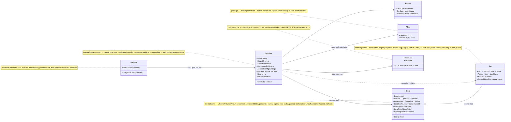

# `bdrive` CLI & sync engine — class diagram

Source of truth: `cmd/bdrive` (commands, gates) and `internal/{syncer,store,
journal,config,daemon,agenthooks,agentskills}`; the `internal/remote` seam is drawn in
[webapp-server.md](webapp-server.md). Reflects the code as of this commit;
update this file in any PR that changes these types or their relationships.

## Sync engine — one cycle

## CLI commands, device state, and the opt-in gate

```mermaid
classDiagram
    direction LR

    class Commands {
        init login logout
        sync stop status log
        url share export import
        web daemon hooks read-log skill
    }
    note for Commands "cmd/bdrive — thin cobra layer; init is the front door, stop pauses"

    class syncBlocked {
        <<gate>>
        enrolled in mounts.json?
        volume not paused?
    }
    note for syncBlocked "cmd/bdrive/helpers.go — sync, sync --hook, and read-log must pass it; reads the registry WITHOUT ResolveMount's enrolling self-heal. Hook mode fails silent; plain sync errors with a bdrive init pointer"

    class openSession {
        mustProject → ResolveMount
        store.Open + remote.Open
    }
    class startSync {
        enroll + clear paused
        initial Cycle
        daemon.Start
    }
    note for startSync "cmd/bdrive/sync_run.go — init's engine; the ONLY enroller and the only thing that resumes a pause"

    class Project {
        +ID stable mount id
        +Volume +Remote +Include
    }
    note for Project ".bdrive/config.json — travels with the folder (git clone, copy); presence alone is NOT consent to sync"

    class MountRegistry {
        mounts.json
        id → Path Volume Remote
    }
    class Device {
        device.json
    }
    class Settings {
        settings.json
        server + token + account
    }
    note for MountRegistry "internal/config — per-device state under BDRIVE_HOME; ResolveMount self-heals the path for enrolled mounts (renames/moves stay free)"

    class AgentHooks {
        Detect / Install / Registered
        turn-start: sync --hook
        post-edit: sync --note
        post-read: read-log
    }
    note for AgentHooks "internal/agenthooks — registers per-platform hook commands (claude, codex, gemini, hermes); they fire in every folder, every turn"

    class PausedMarker {
        volumes/id/paused
    }
    note for PausedMarker "set by bdrive stop, cleared only by bdrive init (startSync)"

    class AgentSkills {
        Detect / Install
        embedded SKILL.md
    }
    note for AgentSkills "internal/agentskills — installs the beardrive skill user-level (per-platform skills dir) from the binary's embedded copy; idempotent, refreshed on upgrade"

    Commands --> AgentSkills : skill install
    AgentHooks --> Commands : runs sync and read-log
    Commands --> syncBlocked : sync and read-log gate first
    syncBlocked --> MountRegistry : reads only, never enrolls
    syncBlocked --> PausedMarker : Paused check
    Commands --> openSession : after the gate
    openSession --> MountRegistry : path self-heal (enrolled only)
    Commands --> startSync : init
    startSync --> MountRegistry : enrolls
    startSync --> PausedMarker : clears
    Commands --> PausedMarker : stop sets
    openSession ..> Project : loads
    openSession ..> Device : identity
    openSession ..> Settings : account and token
```

