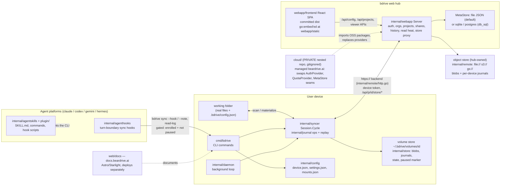

# BearDrive — system overview

The whole repo on one page: every package and surface, and which detail
diagram drills into it. Reflects the code as of this commit; update this
file in any PR that adds/removes a package or changes how the pieces
connect. Detail diagrams: [cli-sync.md](cli-sync.md),
[webapp-server.md](webapp-server.md),
[webapp-frontend.md](webapp-frontend.md).

Not drawn in any detail diagram (deliberately): `web/docs` (content site, no
Go/TS application code) and `cloud/` (private repo — its architecture lives
there; here it only consumes the provider seams drawn in webapp-server.md).
