# Hub frontend (React SPA) — module diagram

Source of truth: `internal/webapp/frontend/src`. The built output is
committed at `internal/webapp/static` (the `go:embed` target), so `go build`
never needs Node. Reflects the code as of this commit; update this file in
any PR that changes these modules or their relationships.

```mermaid
classDiagram
    direction LR

    class App {
        mode from /api/config
    }
    note for App "App.tsx — picks HubApp (multi-project) or VolumeApp (single volume) from server config; frontend learns everything from the API, never sees storage or credentials"

    class HubApp {
        project list, org walls
        admin panels, invites
    }
    class VolumeApp {
        thin wrapper: one volume
    }
    class Browser {
        folder listing, file view
        per-view routes
    }

    class router {
        +VIEW_ROUTES insights history install settings
        +parseRoute(pathname, mode) Route
        +urlForPath / urlForView
        +encodePath / decodePath
    }
    class nav {
        +navigate(url)
        +useLocationPath()
        +linkProps(href)
        +Redirect
    }
    note for nav "nav.ts + router.ts — deliberately NOT a router library (react-router v7 startTransition left stale views); History-API path routing, slashes literal, every user-facing page owns a URL path"

    class api {
        +getJSON / postJSON / api
        types.ts server contracts
    }
    note for api "api/http.ts — all URLs root-absolute so deep paths never break relative resolution"

    class hooks {
        +useConfig
        +useHub
        +useBrowse
    }
    note for hooks "TanStack Query wrappers over the viewer APIs"

    class components {
        FileView FolderListing FileTree
        HistoryView Insights ShareDialog
        OrgAdmin HubSettings ProjectSettings
        Palette shell AccountBar ...
    }
    note for components "components/ui — shadcn/ui primitives (Radix, copied in), themed from BearDrive tokens in tw.css; rendered markdown is transformed as a string before mounting, link clicks delegated on the container — never patch the dangerouslySetInnerHTML subtree"

    App --> HubApp
    App --> VolumeApp
    HubApp --> Browser
    VolumeApp --> Browser
    HubApp --> router
    Browser --> router
    Browser --> components
    HubApp --> components
    components --> nav : linkProps navigate
    hooks --> api
    Browser --> hooks
    HubApp --> hooks
```

