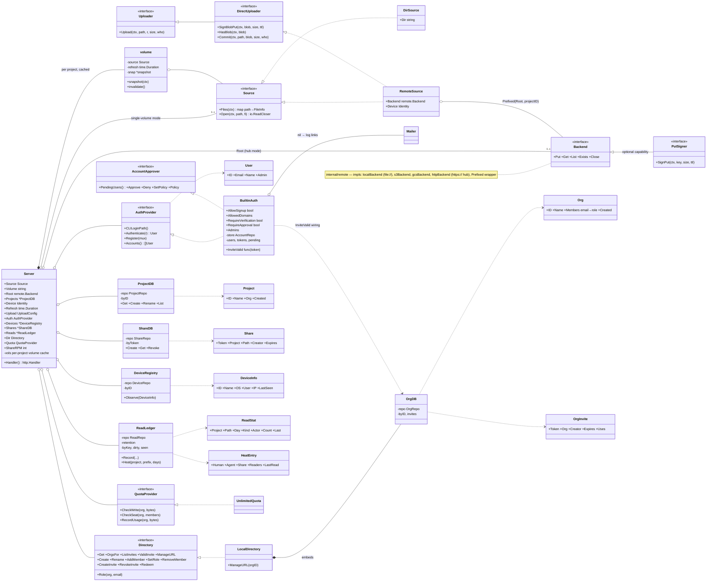
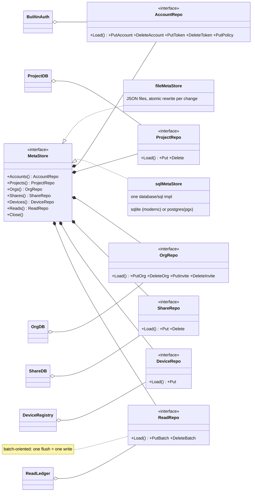

# `bdrive web` server — class diagram

Source of truth: `internal/webapp` (server, services, persistence) and
`internal/remote` (storage backends). Reflects the code as of this commit;
update this file in any PR that changes these types or their relationships.

## Server core, sources, and services

## Metadata persistence (`MetaStore`)

Service structs keep in-memory maps + logic; every change persists as one
record through a typed repo. Blobs and journals never touch this layer.

