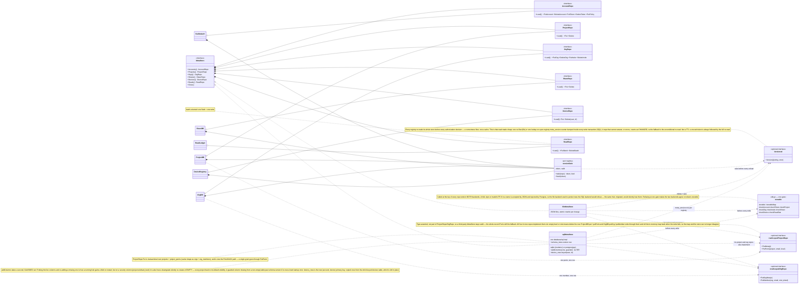

# `bdrive serve` server — class diagram

Source of truth: `internal/webapp` (server, services, persistence) and
`internal/remote` (storage backends). Reflects the code as of this commit;
update this file in any PR that changes these types or their relationships.

## Server core, sources, and services

```mermaid
classDiagram
    direction LR

    class Server {
        +Source Source
        +Volume string
        +Root remote.Backend
        +Projects *ProjectDB
        +Device Identity
        +Refresh time.Duration
        +Upload UploadConfig
        +Auth AuthProvider
        +Devices *DeviceRegistry
        +Shares *ShareDB
        +Reads *ReadLedger
        +Dir Directory
        +Quota QuotaProvider
        +Billing func(email) (plan, url, ok)
        +Analytics AnalyticsConfig
        +ShareRPM int
        +TrustProxy bool
        -vols per-project volume cache
        -grants reservation ledger
        +Handler() http.Handler
    }
    note for Server "clientIP is a METHOD now, not a package func: X-Forwarded-For is honored when the PEER is loopback/private (the operator's own proxy) or TrustProxy is set, and then only its LAST hop. Every caller that gates on an IP — the auth rate limiter, /s/*, device rows, share telemetry — goes through it, so a client-supplied header cannot forge the identity a limiter counts"

    class volume {
        -source Source
        -refresh time.Duration
        -snap *snapshot
        +snapshot(ctx)
        +invalidate()
    }

    class Source {
        <<interface>>
        +Files(ctx) map path→FileInfo
        +Open(ctx, path, fi) io.ReadCloser
    }
    class DirSource {
        +Dir string
    }
    class RemoteSource {
        +Backend remote.Backend
        +Device Identity
        +PresignTTL time.Duration
        +Remove(ctx, path, who, note)
        +OpenBlob(ctx, sha)
        -verify(ctx, sha) re-hash until sealed
        -blobStat(ctx, blob) remote.Object
        -sealed sync.Map sha→proved immutable
        -loadSourcedOps(ctx) []sourcedOp
        -appendOp(ctx, op)
    }
    class sourcedOp {
        +Op journal.Op
        +From journal key's device
    }
    note for sourcedOp "An op's Device field is whatever the writer typed; From is the journal object it actually came out of, which the /store door gates. Attribution reads From — a peer cannot sign someone else's name on a change by editing its own journal"
    note for RemoteSource "OpenBlob is the single blob-read door: the sha must match blobRe, and verify re-hashes the bytes whenever the backend is a PutSigner — in direct-upload mode the server never saw the content, so the store is the only thing that could have swapped it. It stops re-hashing only once the object is PROVABLY immutable: both presign doors refuse a key that exists, so every URL for a blob was minted before its first PUT and dies at mint+PresignTTL; past that age the hub is the only writer left. That is what remote.Object.Modified is for"
    class Uploader {
        <<interface>>
        +Upload(ctx, path, r, size, who, note)
    }
    class DirectUploader {
        <<interface>>
        +SignBlobPut(ctx, blob, size, ttl)
        +BlobSize(ctx, blob) size, exists
        +Commit(ctx, path, blob, size, who, note)
    }
    note for DirectUploader "BlobSize replaced HasBlob: in direct mode the server never sees the bytes, so the CALLER's declared size was the only number it had to quota-check and journal — and the caller picks it. Size now comes from storage, and the commit journals and charges that"
    note for DirectUploader "Commit's note is &quot;&quot; for an upload and &quot;restore &lt;path&gt;@&lt;sha8&gt;&quot; for POST /api/p/{id}/restore — which is the upload commit minus the upload: find the historical op for (path, sha), journal a NEW put at its blob. Never rewrites a journal."
    note for RemoteSource "Every write ends at appendOp: stamp Seq/Lamport/Time + this server's Identity, append ONE op to journal/&lt;own-device&gt;.jsonl. Commit does that for a put; Remove (POST /api/p/{id}/remove, restore's gates + a snapshot existence check) does it for a delete — the only server path that takes a file away, and itself undone by restoring the DELETED row."

    class journalDoor {
        <<Server, /api/p/id/store/*>>
        ownJournal(key) whose journal is this
        journalOps(key, spooled) parse + validate
        opsNameTheirAuthor(ops) whose name
        journalKeepsItsOps(ctx, be, key, ops)
    }
    note for journalDoor "store.go — the invariant &quot;each device writes only its own journal&quot; is now ENFORCED here, not assumed. The key must be journal/&lt;canonical device id&gt;.jsonl for the device in the request header, that device must already be owned by the caller (DeviceRegistry.OwnerOf) or the caller must be a project admin (the recovery arm) — the old first-writer-claims arm is gone. Every op must pass journal.SafePath + config.ReservedPath on its Path and journal.SafeText on Note/Author/UserName, must name its own owner's account, and the upload must keep every Seq the stored journal already had: append-only, 409 on truncation. Bodies are spooled first, and a blob PUT must hash to the key it claims"

    class Backend {
        <<interface>>
        +Put +Get +List +Exists +Close
    }
    class PutSigner {
        <<interface>>
        +SignPut(ctx, key, size, ttl)
    }
    note for Backend "internal/remote — impls: localBackend (file://), s3Backend, gcsBackend, httpBackend (https:// hub), Prefixed wrapper"
    note for Backend "Key handling is fallible now: Prefixed.key and localBackend.path RETURN AN ERROR (safeKey / store.UnderRoot) rather than concatenating, so a `..` key cannot walk out of a project's prefix or out of a file:// root — and Prefixed.List re-checks the STRIPPED key on the way out, since the prefix it removes is the only thing that was ever validated. The httpBackend client is origin-bound: the device token is keyed to settings.Server, SameOrigin is the one rule, refuseOffOriginRedirect is its CheckRedirect, a presign target must be https on a trusted origin (directTargetOK), and List drops keys failing journal.SafePath and clamps a negative Size. gcs SignPut now signs Content-Length too. Object carries Modified (S3 LastModified, GCS Updated, file mtime; zero where the backend has none) — RemoteSource.verify reads it to decide when a blob can no longer be rewritten by a presigned URL"

    class AuthProvider {
        <<interface>>
        +CLILoginPath()
        +Authenticate(r) User
        +Register(mux)
        +Accounts() []User
    }
    class AccountApprover {
        <<interface>>
        +PendingUsers() +Approve +Deny +SetPolicy +Policy
    }
    class BuiltinAuth {
        +AllowSignup bool
        +AllowedDomains
        +RequireVerification bool
        +RequireApproval bool
        +Admins
        +InviteValid func(token)
        +BindDevice func(email, r) error
        +Offboard func(email)
        +BaseURL string
        +Seniority() []string
        -store AccountRepo
        -users, tokens, pending
        -cli CLIAuth
        -refresh re-reads the store before every decision
    }
    note for BuiltinAuth "Revocation is now a real edge, not a cookie change: revokeTokensFor / revokeGrantsForLocked kill every device token and pending CLI grant an account holds, DELETE /api/auth/token revokes one by name, and the same path runs on offboarding. BaseURL replaces trusting the request's Host when composing a reset or verification link — a mail link built from an attacker's Host header is a credential delivered to the attacker"
    class CLIAuth {
        +Register(mux)
        -session func(r) User
        -issue func(w, r, user, device)
        -pending map~cliGrant~
        -pkceOK(challenge, verifier)
        -takeGranted single-use, one lock
        -atGrantCap per-IP and global caps
    }
    note for CLIAuth "The paths bdrive login POSTs by name, served the same way for every provider: /auth/cli, /auth/device/&lt;token&gt;, /api/auth/exchange, /api/auth/device/start, /api/auth/device/poll."
    note for CLIAuth "The loopback flow is PKCE (S256) with NO compatibility arm — a grant without a challenge is refused, because the code rides in a URL the browser and anything watching it can see. cliGrant now separates the LINK the human opens from the credential the CLI polls with, takeGranted consumes a grant inside one critical section (peek-then-take let two pollers win the same code), and pending grants are capped globally and per IP with heaviest-first eviction so the map is not a free memory sink"
    class Mailer
    class User {
        +ID +Email +Name +Admin
    }

    class Directory {
        <<interface>>
        +Role(org, email)
        +Get +OrgsFor +ListInvites +ValidInvite +ManageURL
        +Create +Rename +AddMember +SetRole +RemoveMember
        +CreateInvite +RevokeInvite +Redeem
    }
    class LocalDirectory {
        +ManageURL(orgID)
    }
    class OrgDB {
        -repo OrgRepo
        -byID, invites
        -seniority func() []string
        +EvictMember(org, email)
        +SetSeniority(f)
        -heir(o) promotes an owner
        -refresh re-reads the store before every decision
    }
    class Org {
        +ID +Name +Members email→role +Created
        +Joined email→when
    }
    class offboard {
        <<Server, orgs.go>>
        drop every project grant
        Devices.Release(email)
        evict from every org
    }
    note for offboard "Deleting an account used to leave its access behind: project grants keyed by email, device rows that still owned journals, org memberships. offboard is the one gesture that unwinds all three, and the two tiny interfaces it goes through (orgEvictor, seniorityLister) keep BuiltinAuth and OrgDB from importing each other. EvictMember has no last-owner guard — it promotes an heir instead: earliest Org.Joined, ties broken by account seniority, and no orphan org if there is no evidence"
    class OrgInvite {
        +Token +Org +Creator +Expires +Uses
    }

    class ProjectDB {
        -repo ProjectRepo
        -byID
        +Get +Create +Update +Rename +List
        +SetCreator +SetDefault +SetTemplate
        +SetPerm +ClearPerm
        -refresh re-reads the store on reads AND mutators
    }
    class Project {
        +ID +Name +Org +Created
        +Description +Icon
        +Creator string
        +Template string
        +Default string
        +Perms map email→level
    }
    class seedTemplate {
        <<Server method>>
        POST /api/projects `template`
        templates.Get before GetOrCreate → 400
        Upload() per file, hub's own device
        skips paths that already exist
        CheckWrite / RecordUsage
    }
    note for Project "Default == &quot;&quot; means write — the historical behavior, so an upgraded hub needs no migration. SetPerm/ClearPerm refuse to drop the last explicit admin."

    class projectPerm {
        <<resolver>>
        org owner → admin
        explicit grant → that level
        org member → project Default
        otherwise → none
    }
    note for projectPerm "perms.go — the single authorization ladder. proj(level, h) in server.go is the one choke point: every per-project route declares its level at registration."
    note for projectPerm "Both escape hatches are closed: a project with no org, or naming an org that no longer exists, resolves to none instead of falling through to a default, and org membership is checked BEFORE an explicit grant — so a grant left behind by a removed member is no longer a way back in"

    class ShareDB {
        -repo ShareRepo
        -byToken
        +Create +Get +Revoke +SetExpiry
        -refresh re-reads the store before every decision
    }
    note for ShareDB "A share is now re-checked at READ time, not only at mint time: shareCreatorStillBelongs refuses /s/&lt;token&gt; once its creator has left the project's org, so a link cannot outlive the access that justified it"

    class sandboxInline {
        <<Server, every bytes-out route>>
        inlineMarkup(ct) / inlineType(ct)
        nosniff always
        CSP sandbox allow-scripts for markup
        setContentLength from the stream
        storageErr logs detail, says little
    }
    note for sandboxInline "One helper for every route that returns stored bytes — serveBlob, render, a historical version, the history blob view, and /s/*. Uploaded HTML/SVG/XML is a document a member can author and another member will open on the hub's origin; the sandbox header is what keeps it from acting as the hub. Length is measured from the stream rather than trusting a recorded FileInfo.Size"
    class Share {
        +Token +Project +Path +Creator +Expires
    }

    class DeviceRegistry {
        -repo DeviceRepo
        -byKey devKey → row
        -latest id → newest key
        +Observe(DeviceInfo)
        +Bind(user, d, visible) error
        +Release(user)
        +OwnerOf(id) owner, known
        +MayActAs(user, id) bool
        +LookupIn(id, allowed) DeviceInfo
        -refresh re-reads the store before every decision
    }
    class devKey {
        +User account email
        +ID device id
    }
    class DeviceInfo {
        +ID +Name +OS +User +IP
        +FirstSeen +LastSeen
    }
    note for DeviceRegistry "A device is keyed by (account, id), not by id alone — two accounts naming the same id hold two independent rows, so nothing a stranger sends can overwrite yours. Hub-wide ownership is FIRST CLAIM WINS, decided by FirstSeen. Bind, at token issuance, is the only thing that creates a row for an id that has never synced: it refuses an id another account already owns when the caller can see that account (same org) and otherwise binds nothing and says nothing, so the error is never a cross-org existence oracle. OwnerOf is the write gate the /store journal door asks; MayActAs is the looser telemetry gate (mine, or unclaimed); Release is offboarding's half. IDs are shape-checked and lower-cased at one door (deviceID), so case alone can't fork an identity"

    class ReadLedger {
        -repo ReadRepo
        -retention
        -byKey, dirty, seen
        +Record(...)
        +Heat(project, prefix, days)
    }
    class ReadStat {
        +Project +Path +Day +Kind +Actor +Count +Last
    }
    class HeatEntry {
        +Human +Agent +Share +Readers +LastRead
    }

    class QuotaProvider {
        <<interface>>
        +CheckWrite(org, bytes)
        +CheckSeat(org, members)
        +RecordUsage(org, bytes)
        +CheckRead(org, bytes)
        +RecordEgress(org, bytes)
    }
    class UnlimitedQuota
    note for QuotaProvider "The read half is deliberately ASYMMETRIC. CheckRead is called on /s/* and nowhere else: a public share link is the only unauthenticated door to stored bytes, so it is the only egress a plan can cap and the only bandwidth number worth publishing. Refusing a device mid-sync would surface as ErrForbidden, which the syncer reads as 'access is gone — pause and touch nothing', so /store/* and the viewer only RecordEgress. Sync must never break over a bill"
    class countingWriter {
        <<quota.go>>
        +Write(p) n
        +n int64
    }
    note for countingWriter "Bills what actually reached the client. FileInfo.Size and the journal's Size are claims made BEFORE the write; a reader who abandons a download halfway must not be charged for the whole file"

    class grant {
        +project +org +key
        +size +expires
    }
    class reservations {
        <<Server, reserve.go>>
        reserve / reserveIfFits(org, size, ttl)
        reservedBytes(org) / outstandingLocked
        claimGrant(project, key)
        reconcileGrants(ctx, project, be)
        dropStaleLocked
    }
    note for reservations "The seam between a presigned URL and the plan it spends. CheckWrite alone answered per request, so N concurrent signs each passed against the same free space and the org wrote N times its quota. Every write door now charges size + reservedBytes(org), reserveIfFits is the compare-and-set, and a signed-but-unspent grant expires. reconcileGrants asks the backend whether the blob actually landed and either RecordUsage-s it or gives the space back — the reservation is a hold, never the accounting"

    class AnalyticsConfig {
        +Key string
        +Host string
        +Endpoint() string
    }
    note for AnalyticsConfig "Third managed-deployment seam beside Quota and Billing, but a value rather than an interface — there is nothing to implement, only a project to name. Emitted as /api/config `analytics` when Key is set; empty means the frontend loads no tracker and contacts nobody, which is what a self-hosted hub gets. Endpoint() is exported because the cloud module renders its own loader from the same value."

    Server o-- "0..1" Source : single-volume mode
    Server o-- "0..1" Backend : Root (hub mode)
    Server o-- ProjectDB
    Server o-- AuthProvider
    Server o-- Directory
    Server o-- DeviceRegistry
    Server o-- ShareDB
    Server o-- ReadLedger
    Server o-- QuotaProvider
    Server *-- reservations : holds before it charges
    reservations *-- grant
    reservations ..> QuotaProvider : CheckWrite(size + outstanding), RecordUsage on landing
    ShareDB ..> QuotaProvider : CheckRead before the stream, RecordEgress after
    Server ..> countingWriter : every bytes-out route that bills
    reservations ..> Backend : reconcile — did the blob land
    Server *-- journalDoor : /store/* is the only way a device writes
    journalDoor ..> DeviceRegistry : OwnerOf gates the journal key
    Server *-- sandboxInline : every bytes-out route
    Server *-- offboard : account deletion
    offboard ..> OrgDB : orgEvictor
    offboard ..> ProjectDB : dropPerm
    offboard ..> DeviceRegistry : Release
    OrgDB ..> BuiltinAuth : seniorityLister, for the heir
    BuiltinAuth ..> DeviceRegistry : Bind at token issuance
    Server *-- AnalyticsConfig
    Server *-- volume : per project, cached
    volume o-- Source

    Source <|.. DirSource
    Source <|.. RemoteSource
    Uploader <|-- DirectUploader
    DirectUploader <|.. RemoteSource
    RemoteSource o-- Backend : Prefixed(Root, projectID)
    Backend <|-- PutSigner : optional capability

    AuthProvider <|.. BuiltinAuth
    AccountApprover <|.. BuiltinAuth
    BuiltinAuth *-- CLIAuth : serves bdrive login
    BuiltinAuth o-- Mailer : nil → log links
    AuthProvider ..> User

    Directory <|.. LocalDirectory
    LocalDirectory *-- OrgDB : embeds
    OrgDB ..> Org
    OrgDB ..> OrgInvite
    BuiltinAuth ..> OrgDB : InviteValid wiring

    ProjectDB ..> Project
    Server *-- seedTemplate : on create, when `template` is set
    seedTemplate ..> Uploader : RemoteSource.Upload (blob, then journal)
    seedTemplate ..> ProjectDB : SetTemplate records it once
    Server *-- projectPerm : gates every per-project route
    projectPerm ..> Project : Perms + Default
    projectPerm ..> Directory : org role
    ShareDB ..> Share
    DeviceRegistry ..> DeviceInfo
    DeviceRegistry *-- devKey : (account, id)
    RemoteSource ..> sourcedOp : attribution comes from the journal key
    ReadLedger ..> ReadStat
    ReadLedger ..> HeatEntry
    QuotaProvider <|.. UnlimitedQuota
```

## Metadata persistence (`MetaStore`)

Service structs keep in-memory maps + logic; every change persists as one
record through a typed repo. Blobs and journals never touch this layer.

Two things changed shape here. Every service now `refresh()`es — re-reads its
repo before any decision — because a hub is not always one process: with two
replicas over one Postgres, a revocation or a removal only took effect on the
replica that served it, and the other kept honoring the old map until restart.
And a whole-record `Put` is no longer the only write: the row-scoped
interfaces below let a permission or a membership persist as ONE row, so two
concurrent grants stop overwriting each other's map.


```mermaid
classDiagram
    direction LR

    class MetaStore {
        <<interface>>
        +Accounts() AccountRepo
        +Projects() ProjectRepo
        +Orgs() OrgRepo
        +Shares() ShareRepo
        +Devices() DeviceRepo
        +Reads() ReadRepo
        +Close()
    }

    class AccountRepo {
        <<interface>>
        +Load() +PutAccount +DeleteAccount +PutToken +DeleteToken +PutPolicy
    }
    class ProjectRepo {
        <<interface>>
        +Load() +Put +Delete
    }
    class OrgRepo {
        <<interface>>
        +Load() +PutOrg +DeleteOrg +PutInvite +DeleteInvite
    }
    class ShareRepo {
        <<interface>>
        +Load() +Put +Delete
    }
    class DeviceRepo {
        <<interface>>
        +Load() +Put +Delete(user, id)
    }

    class Versioned {
        <<optional interface>>
        +Version() (string, error)
    }
    note for Versioned "Every registry re-reads its whole store before every authorization decision — a correctness floor, not a cache. This is that read made cheap: one os.Stat (file) or one lookup on a per-registry meta_version counter bumped inside every write transaction (SQL). A repo that cannot answer, or errors, counts as CHANGED, so the fallback is the unconditional re-read. Not a TTL: a moved token is always followed by the full re-read"

    class versionGate {
        <<per registry>>
        -token, valid
        +stale(repo) token, bool
        +fresh(token)
    }

    class rowScopedProjectRepo {
        <<optional interface>>
        +PutMeta(p)
        +PutPerm(project, email, level)
    }
    class rowScopedOrgRepo {
        <<optional interface>>
        +PutOrgMeta(o)
        +PutMember(org, email, role, joined)
    }
    note for rowScopedProjectRepo "Type-asserted, not part of ProjectRepo/OrgRepo, so a third-party MetaStore stays valid — the whole-record Put is still the fallback. All four in-tree repos implement them. An empty level or role means delete the row. ProjectDB.put / putPerm and OrgDB.putOrg / putMember write through them and roll the in-memory map back when the write fails, so the map and the store can no longer disagree"

    class storable {
        <<db.go — one gate>>
        storable / storableMap
        checkAccount checkToken checkProject
        checkOrg checkInvite checkShare
        checkDevice checkReadStat
    }
    note for storable "Called at the top of every repo write in BOTH backends. A NUL byte or invalid UTF-8 in a name is accepted by JSON and rejected by Postgres, so the file backend used to persist rows the SQL backend would refuse — the same hub, migrated, would silently lose them. Refusing at one gate makes the two backends agree on what is storable"
    class ReadRepo {
        <<interface>>
        +Load() +PutBatch +DeleteBatch
    }
    note for ReadRepo "batch-oriented: one flush = one write"

    class fileMetaStore {
        JSON files, atomic rewrite per change
    }
    class sqlMetaStore {
        one database/sql impl
        sqlite (modernc) or postgres (pgx)
        +schema_meta version row
        +addColumns(cols, guarded) ALTER
        +device_rows keyed (user, id)
    }
    note for sqlMetaStore "ProjectRepo.Put is transactional over projects + project_perms (same shape as orgs + org_members), and is now the FALLBACK path — a single grant goes through PutPerm."
    note for sqlMetaStore "addColumns takes a second, GUARDED set. Probing the live columns and re-adding a missing one is how a running hub gains a field on restart, but on a security column (projects.default_level) it is also how a downgrade silently re-creates it EMPTY — every project back to its default visibility. A guarded column missing from a non-empty table past schema version 0 is now a hard startup error. device_rows is the new (account, device) primary key, copied once from the old id-keyed devices table, which is left in place"

    MetaStore <|.. fileMetaStore
    MetaStore <|.. sqlMetaStore
    MetaStore *-- AccountRepo
    MetaStore *-- ProjectRepo
    MetaStore *-- OrgRepo
    MetaStore *-- ShareRepo
    MetaStore *-- DeviceRepo
    MetaStore *-- ReadRepo

    class BuiltinAuth
    class ProjectDB
    class OrgDB
    class ShareDB
    class DeviceRegistry
    class ReadLedger

    BuiltinAuth o-- AccountRepo
    ProjectDB o-- ProjectRepo
    OrgDB o-- OrgRepo
    ShareDB o-- ShareRepo
    DeviceRegistry o-- DeviceRepo
    ReadLedger o-- ReadRepo

    BuiltinAuth *-- versionGate
    ProjectDB *-- versionGate
    OrgDB *-- versionGate
    ShareDB *-- versionGate
    DeviceRegistry *-- versionGate
    versionGate ..> Versioned : asks before every reload
    fileMetaStore ..> Versioned : mtime + size
    sqlMetaStore ..> Versioned : meta_version row per registry
    fileMetaStore ..> rowScopedProjectRepo : its project and org repos also implement
    sqlMetaStore ..> rowScopedProjectRepo : its project and org repos also implement
    fileMetaStore ..> rowScopedOrgRepo
    sqlMetaStore ..> rowScopedOrgRepo
    ProjectDB ..> rowScopedProjectRepo : one perm, one row
    OrgDB ..> rowScopedOrgRepo : one member, one row
    fileMetaStore ..> storable : before every write
    sqlMetaStore ..> storable : before every write
```
